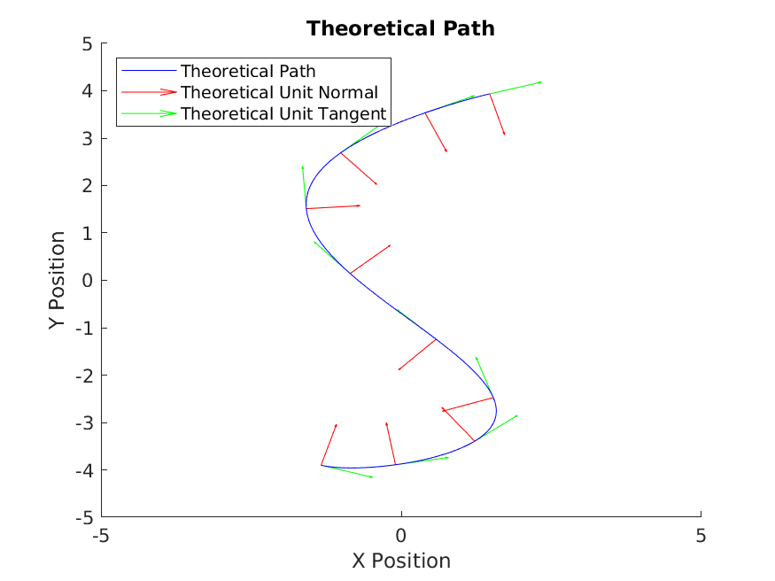
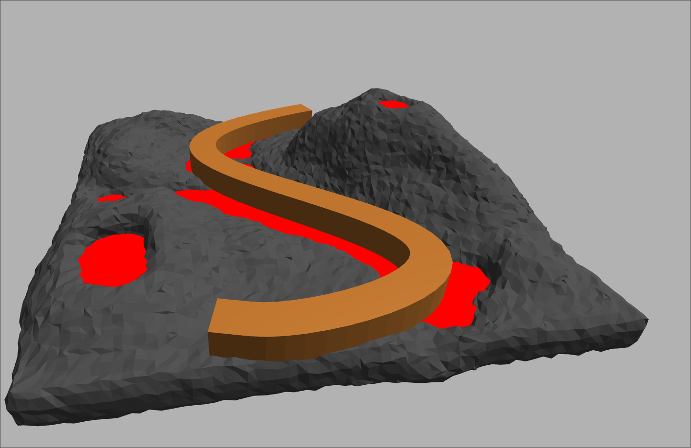
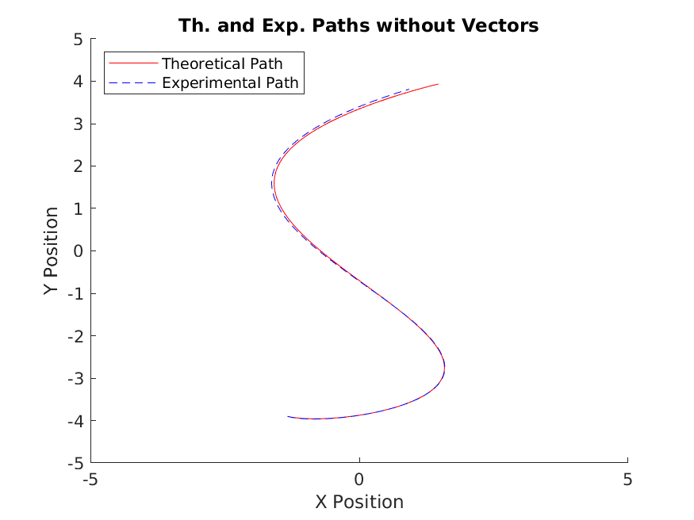
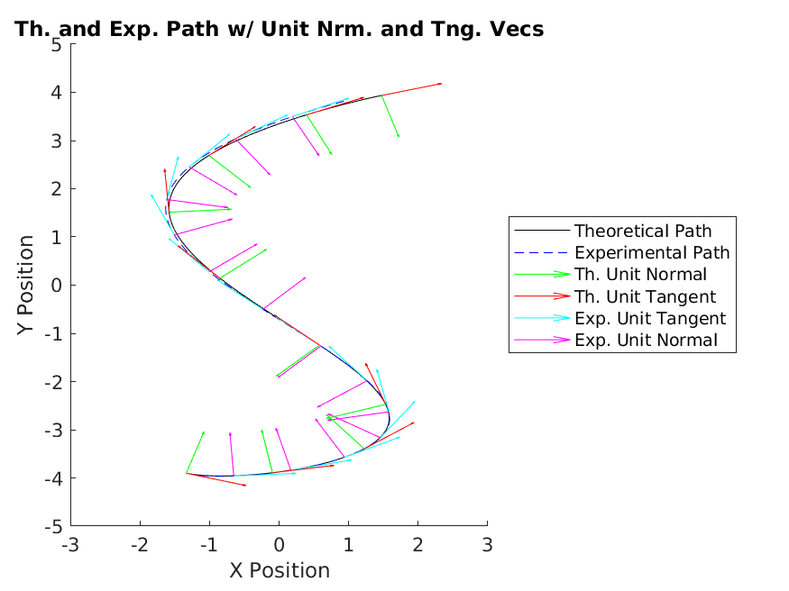
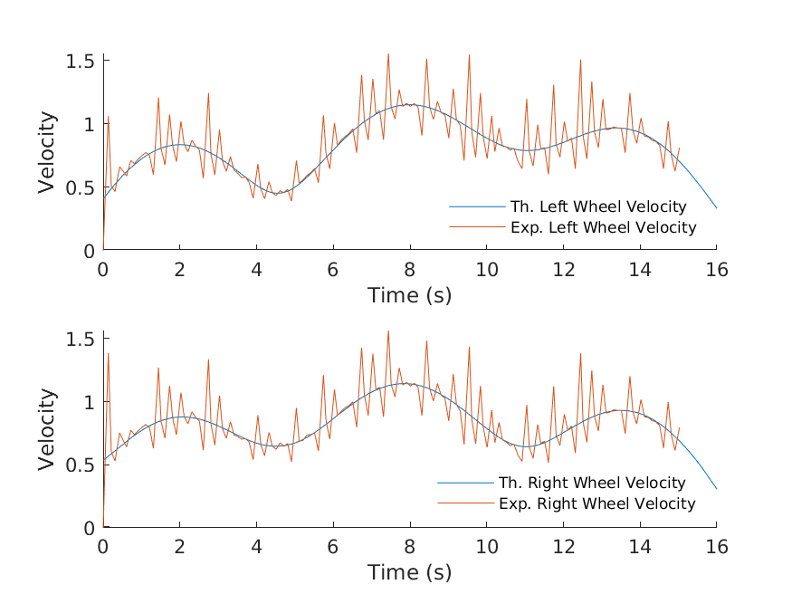
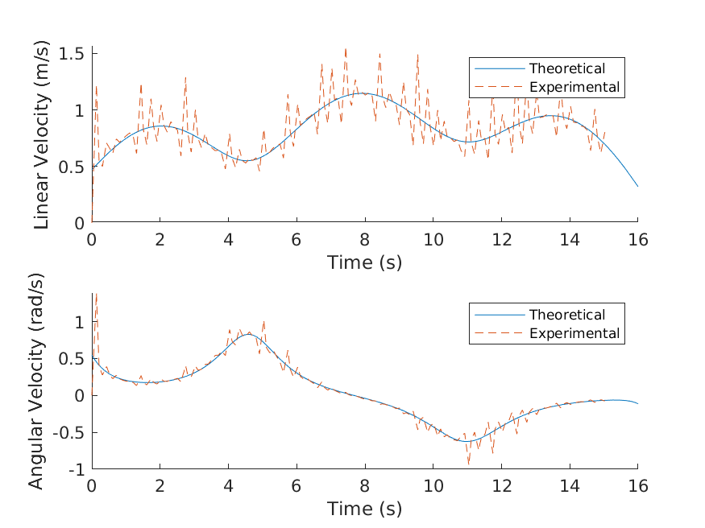

# QEA Presents: The Bridge of Doom

*One brave robot defies all odds to survive the Bridge of Doom.*

*Narrated by Jack Greenberg*

## Introduction

The challenge of the project was to get the simulated NEATO (Roomba-like robot with two-wheel differential drive) to get from one end of a tight bridge to the other without falling off. This was accomplished using MATLAB's ROS (Robotic Operating System) toolbox as well as a lot of calculus.

### The Bridge

The bridge followed the took the shape of the following curve:

The equation of the curve is
$$
\mathbf r(u) = 4\cdot[0.3960cos(2.65(u+1.4)) \mathbf{\hat i} -0.99sin(u+1.4)\mathbf{\hat j}], u \in [0,3.2].
$$

## Methodology

To get the simulated NEATO to move, I needed to use MATLAB's ROS Toolbox, which provided functions to control the left and right wheel speed of the robot. However, we were only given the path of the bridge, and nothing more. Additionally, the bridge is in terms of a single variable which tells us nothing about a time scale. So we make a substitution:
$$
u = \beta t
$$
where  is some independent variable and  is time in seconds. It turns out that beta ends up having control over the speed of the NEATO, which is important because the motors of the NEATO have a top speed of 2 m/s. I then differentiate with respect to and determine the velocity. I also determined the unit normal and tangential vectors along the path by doing:
$$
\mathbf{\hat T} = \frac{\mathbf{r}'}{|\mathbf{r'}|},
\mathbf{\hat N} = \frac{\mathbf{\hat T}'}{|\mathbf{\hat T'}|}
$$
Finally we can determine the angular velocity doing:
$$
\boldsymbol{\omega} = \mathbf{\hat T} \times \frac{d\mathbf{\hat T}}{dt}
$$

We can then determine left and right wheel speed by doing:
$$
V_L = V + \frac{\omega d}{2}, V_R = V - \frac{\omega d}{2}.
$$
Where is the wheel base of the NEATO, **0.235** in our case and is the linear speed, or . I used these functions to dictate the speed of the NEATO. I then need to set the beta parameter to control the speed of the NEATO. I chose **.2** because the if we plot the wheel speeds over time with a beta of .2 the speeds never exceed 2 m/s, which is the limit of the NEATO's motors.

## Results

[Here is a link to the video of the NEATO crossing the Bridge of Doom](https://youtu.be/FyuYOvEM_9E]). The robot is programmed to follow the path of the bridge and then do a little dance at the end. ​

### Analysis

Beginning with a plot of the theoretical curve overlaid with the experimental curve, you can see that the path is nearly identical:

In fact, at the beginning, it is hard to tell that there are two plots at all. You can also look at the same plot but with tangent and normal unit vectors:

Again you see that the vectors line up as we would expect.

Next, you see the plots of the wheel velocities:

The spikiness of the experimental results is due to measurement errors in the NEATO, but you can see that in general the experimental wheel velocities match the planned wheel velocities, which is responsible for the two curves lining up together so nicely.

Finally, we have the graphs of linear and angular velocity:

Again we see the spikiness, but things still match up fairly well.